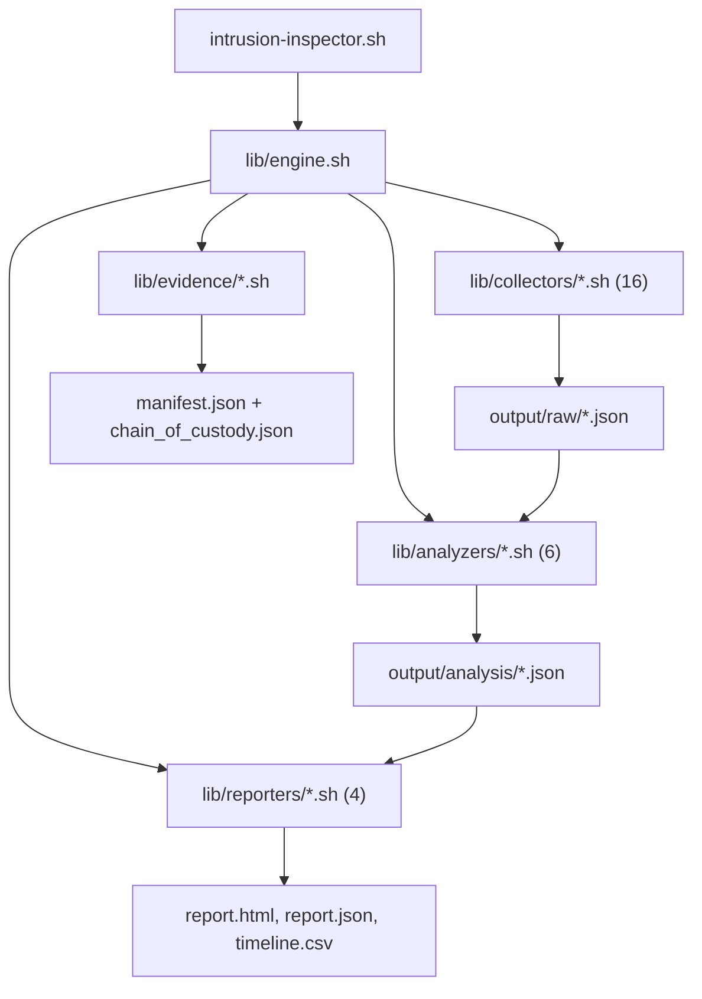

# AI Agent Instructions

## Project Context

IntrusionInspector (Bash Edition) is a cross-platform DFIR (Digital Forensics and Incident Response) triage tool for macOS and Linux. It collects forensic artifacts from live endpoints, analyzes them with anomaly detection and IOC/Sigma/YARA scanning, maps findings to MITRE ATT&CK, and produces reports in HTML, JSON, CSV, and console formats.

Key constraints:

- **Language**: Bash 3.2+ (must run on macOS default bash — no associative arrays, no `${var,,}`)
- **Dependencies**: Zero external dependencies for core functionality. `jq`, `sqlite3`, `yara`, and `zip` are optional enhancements
- **Platforms**: macOS (BSD userland) and Linux (GNU userland, Debian/Ubuntu/RHEL/CentOS/Fedora)

## Commands

Use the `justfile` for all standard operations:

```bash
just                  # Show all available recipes
just triage           # Full pipeline: collect + analyze + report (requires sudo)
just collect          # Collect artifacts only (requires sudo)
just analyze          # Analyze previously collected artifacts
just report           # Generate reports from analysis results
just verify           # Verify evidence integrity against manifest
just quick            # Quick triage (5 collectors, ~30s)
just standard         # Standard triage (16 collectors, ~2min)
just full             # Full triage with YARA + file hashing (~5min)
just lint             # bash -n syntax check on all scripts
just shellcheck       # Static analysis with shellcheck
just loc              # Lines of code count
just clean            # Remove output directory
```

## Architecture



**Pipeline flow**: CLI parses args and dispatches to `engine_*` functions. The engine loads a profile, runs collectors (writing JSON to `raw/`), seals evidence with SHA-256 manifests, runs analyzers (writing to `analysis/`), and generates reports.

**Convention-based dispatch**: Collectors use `collect_<name>()`, reporters use `report_<format>()`. New modules are auto-discovered via glob sourcing in `engine.sh`.

## Code Conventions

### Bash 3.2 Compatibility (Critical)

- **No associative arrays** (`declare -A`) — macOS ships Bash 3.2
- **No `${var,,}` lowercasing** — use `echo "$var" | tr '[:upper:]' '[:lower:]'`
- Use `case` functions as lookup tables instead of associative arrays (see `_suspicious_children()` and `_severity_weight()` in `config.sh`)

### Shell Standards

- `set -euo pipefail` in entry points
- All variables quoted: `"$variable"` not `$variable`
- `local` for all function variables
- `[[ ]]` for conditionals, never `[ ]`
- `readonly` for constants: `readonly MAX_RETRIES=3`
- Prefer `printf` over `echo` for formatted output

### Naming

- Scripts: lowercase with underscores (`shell_history.sh`)
- Functions: lowercase with underscores matching the module (`collect_shell_history`)
- Local variables: lowercase with underscores (`local db_name`)
- Constants: SCREAMING_SNAKE_CASE (`MAX_RISK_SCORE`)
- Include guards: `_MODULE_LOADED` pattern

### Documentation

- Every file needs a header comment block (delimited by `# ===`) explaining purpose, architecture role, and platform support
- Every function needs a multi-line `# ---` delimited comment with parameters, return values, and design notes
- Comments explain _why_, not _what_

### JSON Generation

- Use `json_object`, `json_kvs`, `json_kvn`, `json_array` from `lib/core/json.sh` for building JSON
- For bulk data (hundreds+ items), use `awk` for JSON generation instead of per-item shell function calls (see `processes.sh` for the pattern)
- Use `json_write` to write JSON files
- `jq` is optional — always provide a `grep`/`sed` fallback path

## Common Tasks

### Adding a New Collector

1. Create `lib/collectors/my_collector.sh`
2. Define `collect_my_collector()` taking `$1` = output_dir
3. Use `write_collector_result` to save output to `raw/my_collector.json`
4. Add `"my_collector"` to the relevant profile arrays in `profiles/*.conf`
5. The engine auto-discovers it via glob sourcing — no registration needed

### Adding an Analyzer

1. Create `lib/analyzers/my_analyzer.sh`
2. Define `analyze_my_analyzer()` taking `$1` = output_dir
3. Write results to `analysis/my_analyzer.json`
4. Add the analyzer call to `run_analyzers()` in `lib/engine.sh` (analyzers are explicitly ordered)

### Adding a Reporter

1. Create `lib/reporters/my_format_reporter.sh`
2. Define `report_my_format()` taking `$1` = output_dir
3. Auto-discovered when format `"my_format"` is requested via `--format`

### Cross-Platform Testing

- Use `has_cmd` to check tool availability before platform-specific calls
- Use `compute_sha256`, `file_size`, `epoch_now` wrappers from `utils.sh` / `platform.sh`
- Test on macOS (BSD `sed`, `stat`, `date`) and Linux (GNU equivalents)

## Project Structure

```
intrusion-inspector.sh           # CLI entry point — argument parsing + dispatch
lib/
├── engine.sh                    # Pipeline orchestrator — sources + coordinates all modules
├── core/
│   ├── config.sh                # Constants, detection signatures, platform paths
│   ├── json.sh                  # Pure-bash JSON builder (no jq dependency)
│   ├── logging.sh               # Colored logging + audit trail
│   ├── platform.sh              # OS detection, cross-platform wrappers
│   └── utils.sh                 # General utilities (hashing, file ops)
├── collectors/                  # 16 forensic artifact collectors
├── analyzers/                   # 6 analysis engines
├── reporters/                   # 4 report generators (html, json, csv, console)
└── evidence/                    # SHA-256 manifests + chain of custody
profiles/                        # Collection profiles (quick / standard / full)
rules/                           # Detection rules (IOC YAML, Sigma YAML, YARA)
```

## Files to Avoid Modifying

- `output/` — Generated evidence artifacts (gitignored)
- `rules/iocs/`, `rules/sigma/`, `rules/yara/` — Example rule files (customize, don't delete)
- `profiles/*.conf` — Only modify to add/remove collectors from profiles, not to change profile structure

## Quality Gates

Before committing:

```bash
just lint              # All scripts must pass bash -n syntax check
just shellcheck        # All scripts must pass shellcheck static analysis
```

## Commit Messages

Follow conventional commits:

```
feat(collector): add USB device collector for Linux
fix(evidence): handle missing /proc on macOS
perf(processes): use awk for bulk JSON generation
docs(readme): update MITRE ATT&CK coverage table
refactor(engine): extract profile loading into function
```

Types: `feat`, `fix`, `docs`, `style`, `refactor`, `perf`, `test`, `build`, `ci`, `chore`

Scopes: `collector`, `analyzer`, `reporter`, `evidence`, `engine`, `core`, `cli`, `readme`
