# IntrusionInspector (Bash Edition)

[](https://www.gnu.org/software/bash/)
[](LICENSE)
[](https://attack.mitre.org)
[](#collectors)
[](https://just.systems)

[](#collectors)
[](#analyzers)
[](#output-structure)
[](#mitre-attck-coverage)
[](#evidence-integrity)
[-brightgreen?style=flat-square)](#tech-stack)

> Cross-platform DFIR artifact collection, analysis, and triage tool for endpoint incident response — implemented entirely in bash with zero external dependencies. Runs on macOS (including Bash 3.2) and Linux (Debian/Ubuntu, RHEL/CentOS/Fedora). Port of the Python [IntrusionInspector](https://github.com/kgaston/IntrusionInspector).

## Overview

IntrusionInspector automates the tedious, error-prone process of collecting forensic artifacts from live endpoints during incident response. Instead of manually running dozens of commands and copying output into reports, responders run a single command that collects 16 categories of artifacts, analyzes them for anomalies and known indicators of compromise, maps findings to the MITRE ATT&CK framework, and produces self-contained HTML reports ready for stakeholder review.

The tool is designed for incident responders, SOC analysts, and DFIR practitioners who need to triage endpoints quickly without installing agents or dependencies. It ships as a single directory of bash scripts that can be copied to any macOS or Linux system and run immediately.

## Architecture

```mermaid
flowchart LR
    subgraph input [Input Layer]
        CLI["fa:fa-terminal CLI<br/>intrusion-inspector.sh"]
        Profiles["fa:fa-file-alt Profiles<br/>quick / standard / full"]
        Rules["fa:fa-shield-alt Detection Rules<br/>IOC / Sigma / YARA"]
    end

    subgraph orchestration [Orchestration]
        Engine["fa:fa-cogs Engine<br/>lib/engine.sh"]
        Platform["fa:fa-desktop Platform Detect<br/>macOS vs Linux"]
    end

    CLI --> Engine
    Profiles --> Engine
    Engine --> Platform

    subgraph collect [Collection Phase — 16 Collectors]
        direction TB
        subgraph sysCollectors [System]
            C1["System Info"]
            C2["Processes"]
            C3["Network"]
            C4["Users"]
        end
        subgraph secCollectors [Security]
            C5["Persistence"]
            C6["Firewall"]
            C7["Certificates"]
            C8["Kernel Modules"]
        end
        subgraph artifactCollectors [Artifacts]
            C9["Filesystem"]
            C10["Logs"]
            C11["Browser"]
            C12["Shell History"]
        end
        subgraph deviceCollectors [Device / Env]
            C13["USB Devices"]
            C14["Software"]
            C15["Environment"]
            C16["Clipboard"]
        end
    end

    Platform --> collect

    subgraph integrity [Evidence Integrity]
        Manifest["SHA-256 Manifest"]
        Audit["Audit Log"]
        CoC["Chain of Custody"]
    end

    collect --> integrity

    subgraph analyze [Analysis Phase — 6 Analyzers]
        IOC["IOC Scanner"]
        YARA["YARA Engine"]
        Sigma["Sigma Engine"]
        Anomaly["Anomaly Detector"]
        TL["Timeline Generator"]
        MITRE["ATT&CK Mapper"]
    end

    Rules --> analyze
    integrity --> analyze

    subgraph output [Output Phase — 4 Reporters]
        HTMLReport["HTML Report<br/>+ ATT&CK Matrix"]
        JSONExport["JSON Export"]
        CSVTimeline["CSV Super Timeline"]
        ConsoleOut["ANSI Console"]
    end

    analyze --> output
```



## Quick Start

```bash
# Clone
git clone <repo-url> && cd LLR

# Full triage (collect + analyze + report) — requires root
sudo bash intrusion-inspector.sh triage -o ./case_001/ \
    --case-id "IR-2025-042" --examiner "K. Gaston"

# Quick triage (5 collectors, ~30 seconds)
sudo bash intrusion-inspector.sh triage -o ./case_001/ -p quick

# With IOC/Sigma/YARA rules
sudo bash intrusion-inspector.sh triage -o ./case_001/ \
    --iocs rules/iocs/ --sigma rules/sigma/ --yara rules/yara/

# Encrypted evidence package for transport
sudo bash intrusion-inspector.sh triage -o ./case_001/ \
    --secure-output --password "CaseKey"

# Verify evidence integrity
bash intrusion-inspector.sh verify -i ./case_001/

# Or use just (if installed)
just triage
just quick
just verify
```

## CLI Commands

| Command | Description |
|---------|-------------|
| `triage` | Full pipeline: collect + analyze + report |
| `collect` | Collect artifacts only |
| `analyze` | Analyze previously collected artifacts |
| `report` | Generate reports from analysis results |
| `verify` | Verify evidence integrity against manifest |

### Key Flags

| Flag | Commands | Description |
|------|----------|-------------|
| `--output, -o` | triage, collect | Output directory |
| `--profile, -p` | triage, collect | Collection profile: `quick`, `standard`, `full` |
| `--case-id` | triage, collect | Case identifier for chain of custody |
| `--examiner` | triage, collect | Examiner name for chain of custody |
| `--iocs` | triage, analyze | IOC rules path |
| `--sigma` | triage, analyze | Sigma rules path |
| `--yara` | triage, analyze | YARA rules path |
| `--secure-output` | triage | Encrypt evidence package (ZIP + password) |
| `--password` | triage | Password for encrypted package |
| `--format, -f` | triage, report | Report format: `html`, `json`, `csv`, `console` |
| `--verbose, -v` | all | Enable debug logging |

## Collection Profiles

| Profile | Collectors | File Hashing | YARA | Typical Duration |
|---------|-----------|--------------|------|------------------|
| `quick` | 5 (system, processes, network, users, persistence) | No | No | ~30 seconds |
| `standard` | 16 (all) | No | No | ~2 minutes |
| `full` | 16 (all) | Yes | Yes | ~5 minutes |

## Collectors

| Collector | macOS | Linux | Artifacts |
|-----------|-------|-------|-----------|
| System Info | `sysctl`, `sw_vers`, `system_profiler` | `/proc`, `uname`, `hostnamectl` | Hostname, OS, IPs, CPU, RAM |
| Processes | `ps aux` | `ps aux`, `/proc` | PID, cmdline, parent, user |
| Network | `netstat`, `lsof`, `arp` | `ss`, `netstat`, `/proc/net` | Connections, DNS, ARP |
| Users | `dscl`, `last` | `/etc/passwd`, `utmp`, `last` | Accounts, logins, groups |
| Persistence | `launchctl`, `cron` | `cron`, `systemd`, `/etc/init.d` | Autostart mechanisms |
| Filesystem | `/tmp`, recent items | `/tmp`, `/var/tmp`, `/dev/shm` | Suspicious files |
| Logs | `log show` (unified log) | `syslog`, `auth.log`, `journal` | Security logs |
| Browser | Chrome, Firefox, Safari | Chrome, Firefox | History, downloads |
| Shell History | `~/.zsh_history`, `~/.bash_history` | `~/.bash_history`, `~/.zsh_history` | Command history |
| USB Devices | `system_profiler SPUSBDataType` | `syslog`, `lsusb` | Device history |
| Software | `system_profiler`, `brew` | `dpkg`, `rpm`, `snap`, `flatpak` | Installed apps |
| Kernel Modules | `kextstat` | `lsmod`, `/proc/modules` | Loaded modules |
| Firewall | `pfctl` | `iptables`, `nftables`, `ufw` | Firewall rules |
| Environment | `env`, `launchctl` | `env`, `/proc/*/environ` | Environment variables |
| Clipboard | `pbpaste` | `xclip`, `xsel`, `wl-paste` | Clipboard contents |
| Certificates | `security`, Keychain | `/etc/ssl`, `openssl` | Certificate stores |

## Analyzers

| Analyzer | Description | Detection Method |
|----------|-------------|-----------------|
| IOC Scanner | Matches artifacts against YAML-defined indicators | Hash, IP, domain, filepath, process name matching |
| YARA Scanner | Runs YARA rules against collected files | Pattern matching (optional, requires `yara` CLI) |
| Sigma Scanner | Evaluates Sigma detection rules against logs | Field-based log analysis |
| Anomaly Detector | Heuristic checks with MITRE ATT&CK mapping | LOLBins, parent-child, temp execution, etc. |
| Timeline Generator | Super timeline from all collectors | Timestamp aggregation and sorting |
| MITRE ATT&CK Mapper | Aggregates technique IDs, generates Navigator layer | Cross-analyzer technique correlation |

## MITRE ATT&CK Coverage

The anomaly detector maps findings to ATT&CK techniques:

| Check | Techniques | Severity |
|-------|-----------|----------|
| LOLBins usage | T1218, T1216 | Medium |
| Unusual parent-child processes | T1055, T1036 | High |
| Temp directory execution | T1204 | High |
| Suspicious scheduled tasks | T1053 | Medium |
| Unusual network connections | T1071 | Medium |
| Base64-encoded commands | T1027, T1059 | High |
| Unusual services | T1543 | Medium |
| PATH hijacking | T1574 | High |
| Rogue certificates | T1553 | Medium |
| Suspicious kernel modules | T1547, T1014 | Critical |
| Clipboard monitoring | T1115 | Low |
| Firewall tampering | T1562 | High |

## Evidence Integrity

Every collection produces:

- **`manifest.json`** — SHA-256 hash of every collected file, plus a hash of the manifest itself stored in chain of custody
- **`audit.log`** — Timestamped log of every action taken during collection
- **`chain_of_custody.json`** — Case ID, examiner, system IDs, timestamps, manifest hash, artifact and file counts, tool version

Verify integrity at any time:

```bash
bash intrusion-inspector.sh verify -i ./case_001/
# or
just verify
```

## Output Structure

```
case_001/
├── raw/                          # Raw collector output (JSON per collector)
│   ├── system_info.json
│   ├── processes.json
│   ├── network.json
│   └── ...                       # 16 collector files total
├── analysis/                     # Analysis results
│   ├── anomaly_detector.json
│   ├── timeline.json
│   ├── ioc_scanner.json          # (if IOC rules provided)
│   ├── sigma_scanner.json        # (if Sigma rules provided)
│   ├── yara_scanner.json         # (if YARA rules provided)
│   └── mitre_attack_summary.json
├── report.html                   # Full HTML report with ATT&CK matrix
├── report.json                   # JSON export for SIEM ingestion
├── timeline.csv                  # CSV super timeline
├── findings.csv                  # CSV findings export
├── attack_navigator_layer.json   # ATT&CK Navigator layer
├── manifest.json                 # Evidence integrity manifest
├── audit.log                     # Collection audit log
└── chain_of_custody.json         # Chain of custody metadata
```

## Project Structure

```
LLR/
├── intrusion-inspector.sh        # CLI entry point
├── justfile                      # Task runner recipes
├── profiles/                     # Collection profiles
│   ├── quick.conf
│   ├── standard.conf
│   └── full.conf
├── rules/                        # Detection rules
│   ├── iocs/                     # IOC definitions (YAML)
│   ├── sigma/                    # Sigma rules (YAML)
│   └── yara/                     # YARA rules
├── lib/
│   ├── engine.sh                 # Pipeline orchestrator
│   ├── core/                     # Shared libraries
│   │   ├── platform.sh           # OS detection, cross-platform wrappers
│   │   ├── json.sh               # Pure-bash JSON builder
│   │   ├── logging.sh            # Colored logging + audit trail
│   │   ├── config.sh             # Constants, defaults, detection lists
│   │   └── utils.sh              # General utilities
│   ├── collectors/               # 16 forensic artifact collectors
│   │   ├── system_info.sh
│   │   ├── processes.sh
│   │   ├── network.sh
│   │   └── ...
│   ├── analyzers/                # 6 analysis engines
│   │   ├── anomaly_detector.sh
│   │   ├── ioc_scanner.sh
│   │   ├── timeline.sh
│   │   └── ...
│   ├── reporters/                # 4 report generators
│   │   ├── html_reporter.sh
│   │   ├── json_reporter.sh
│   │   ├── csv_reporter.sh
│   │   └── console_reporter.sh
│   └── evidence/                 # Evidence integrity
│       ├── integrity.sh
│       └── chain_of_custody.sh
├── AGENTS.md                    # AI agent development guide
├── CONTRIBUTING.md              # Contributor guidelines
├── OWNERS.yaml                  # Code ownership
├── LICENSE                      # MIT License
└── README.md
```

## Development

```bash
just lint              # Syntax check all scripts
just shellcheck        # Static analysis (requires shellcheck)
just loc               # Lines of code
just list-collectors   # List all collector functions
just list-analyzers    # List all analyzer functions
just list-reporters    # List all reporter functions
just version           # Show version
just clean             # Remove output directory
```

## Tech Stack

| Component | Technology |
|-----------|-----------|
| Language | Bash 3.2+ (macOS compatible) |
| Task Runner | [just](https://just.systems) |
| JSON Building | Pure-bash (`lib/core/json.sh`) |
| JSON Parsing | `jq` (optional, graceful fallback to `grep`/`sed`) |
| Bulk Data Processing | `awk` (for performance-critical JSON generation) |
| Hashing | `shasum -a 256` (macOS) / `sha256sum` (Linux) |
| YARA Scanning | `yara` CLI (optional) |
| Encrypted Output | `zip -P` (optional) |
| Platform Detection | `uname`, `/proc`, `sw_vers` |

## Environment Variables

| Variable | Default | Description |
|----------|---------|-------------|
| `II_OUTPUT_DIR` | `./output` | Default output directory |
| `II_CASE_ID` | (empty) | Default case identifier |
| `II_EXAMINER` | (empty) | Default examiner name |
| `LOG_FORMAT` | `color` | Logging format: `color`, `plain` |
| `LOG_LEVEL` | `INFO` | Log level: `DEBUG`, `INFO`, `WARNING`, `ERROR` |

## Contributing

See [CONTRIBUTING.md](CONTRIBUTING.md) for development setup, coding standards, and how to add new collectors, analyzers, and reporters.

## Differences from the Python Version

| Feature | Python | Bash |
|---------|--------|------|
| Language | Python 3.12+ | Bash 3.2+ |
| Dependencies | psutil, rich, jinja2, pydantic, etc. | Zero (bash + standard Unix tools) |
| JSON handling | Built-in `json` module | Pure-bash builder + optional `jq` |
| HTML reports | Jinja2 templates | Heredoc templates |
| Console output | Rich library | ANSI escape codes |
| Deployment | `uv sync` + pip packages | Copy script directory |
| Windows support | Yes | No (macOS + Linux only) |
| Process introspection | psutil (cross-platform) | `ps` + `/proc` |

## License

[MIT](LICENSE) — Copyright (c) 2022 Kody Gaston
